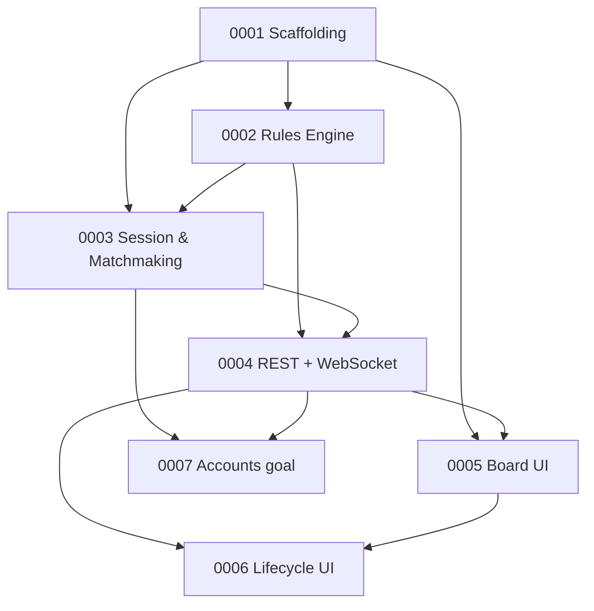

# dame-ai — High-Level Plan (Grobplan)

Online **Deutsche Dame** (German checkers) for **2 browser-based players**, served by a
Quarkus web application with a React UI. The server is the single source of truth and
enforces all rules so that **cheating is impossible**.

This roadmap is split into coarse-grained **Features**. Each feature lives in
`backlog/FeatureXXXX/FeatureXXXX.md`. Breaking features down into user stories happens
later, per feature, right before implementation.

---

## Confirmed product decisions

| Topic | Decision |
|---|---|
| Rule variant | **Deutsche Dame**, 8×8 board, 12 pieces per player |
| King ("Dame") | **Flying king** — moves/captures any distance diagonally |
| Men capture direction | Forward only (men may **not** capture backward) |
| Mandatory capture | **Schlagzwang** — if a capture is available it must be played; multi-captures must be continued. No maximal-capture (Mehrheitsschlag) rule. |
| Matchmaking (MVP) | The **first two clients** that open the app join the one game. It stays bound to them until the game finishes or a player aborts. |
| Matchmaking (goal) | Evolve toward **user accounts** + invitations/lobby (Feature0007). |
| State persistence | **In-memory** only (no database). Server restart ends the game. |
| Live updates | **WebSocket** — server pushes authoritative state to both clients. |
| Frontend | **React** SPA. *(Note: `CLAUDE.md` is contradictory — overview says React, module table says Angular 20. Plan assumes React; needs confirmation.)* |
| Backend | Quarkus 3.36, Java 17, Gradle multi-module (`:app`, `:business`, `:rest`, `:frontend`). |

## Deutsche Dame rules (authoritative summary)

Source: [Dame (Spiel) — Wikipedia](https://de.wikipedia.org/wiki/Dame_(Spiel)).

- 8×8 board, only the 32 dark squares are used. Each player has 12 men on the dark
  squares of their first three rows.
- **Men** move one square diagonally **forward**. They capture by jumping an adjacent
  single enemy piece into the empty square beyond it — **forward only**.
- **Schlagzwang:** when any capture is possible, a capture must be played. A multi-jump
  must be continued until no further capture is possible from the landing square.
- A man that reaches the opponent's back row is promoted to a **Dame** (king).
- A **Dame** (flying king) moves any number of empty squares diagonally, forward or
  backward, and may capture a single enemy piece from a distance, landing on any empty
  square beyond it.
- **Win:** a player wins when the opponent has no legal move (no pieces left, or all
  pieces blocked).
- **Draw:** by mutual agreement.

## Anti-cheat principle (cross-cutting)

Cheating is prevented structurally, not by trust:

- The **`:business` rules engine is the single authority** for legality. The client never
  decides what is legal; it only renders state and submits move *intentions*.
- The server (`:rest`) accepts a move only if: it comes from the player **whose turn it
  is**, it is a **legal move** per the engine, and Schlagzwang is satisfied. Anything else
  is rejected; the rejecting/authoritative state is pushed back over WebSocket.
- Each client only ever receives state it is entitled to see (its own view of the shared,
  fully-visible board).

This principle is realized mainly in **Feature0002** (engine) and **Feature0004**
(server-side validation + transport).

---

## Feature overview & dependencies

| # | Feature | Modules | Depends on |
|---|---|---|---|
| 0001 | Project Scaffolding & Build Foundation | all | — |
| 0002 | Checkers Rules Engine (Deutsche Dame) | `:business` | 0001 |
| 0003 | Game Session & Matchmaking (in-memory, first-two-players) | `:business` | 0001, 0002 |
| 0004 | Realtime Communication (REST + WebSocket) & Server-side Validation | `:rest` | 0002, 0003 |
| 0005 | Game Board UI (React) | `:frontend` | 0001 (mock), 0004 (live) |
| 0006 | Game Lifecycle UI (turns, end states, resign/abort, rematch) | `:frontend` | 0004, 0005 |
| 0007 | User Accounts & Matchmaking Evolution (goal) | `:business`, `:rest`, `:frontend` | 0003, 0004 |

## Parallelization for 2 developers

- **Phase 1 (together):** Feature0001 — establish the build so both can work.
- **Phase 2 (parallel):** Dev A → Feature0002 (rules engine, pure logic, TDD-heavy).
  Dev B → Feature0005 board rendering against a mocked/static state.
- **Phase 3:** Feature0003 + Feature0004 wire the engine to the network (can be split:
  one on session/matchmaking, one on transport, against an agreed API contract).
- **Phase 4:** Feature0006 polishes the full game loop end-to-end.
- **Later:** Feature0007 (accounts) once the 2-player MVP is solid.

Define the **REST + WebSocket message contract early** (start of Phase 2/3) so frontend
and backend can progress against the same interface without blocking each other.
