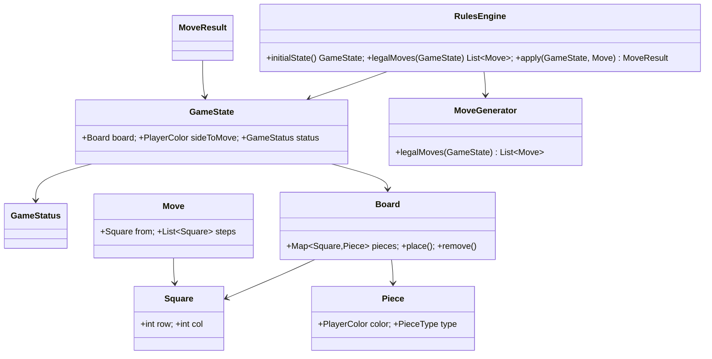

# Checkers Rules Engine (Deutsche Dame) Implementation Plan

> **For agentic workers:** REQUIRED SUB-SKILL: Use superpowers:subagent-driven-development (recommended) or superpowers:executing-plans to implement this plan task-by-task. Steps use checkbox (`- [ ]`) syntax for tracking. Mark each item done in this file immediately after completing it.

**Goal:** Build a self-contained, fully tested Deutsche Dame rules engine in the `:business` module that is the single source of truth for move legality — no networking, persistence, or UI.

**Architecture:** Immutable Java `record`/`enum` domain types under `ai.dame.business.game`, a `MoveGenerator` that enumerates the legal moves for a state (applying Schlagzwang), and a `RulesEngine` façade exposing `initialState()`, `legalMoves(state)`, and `apply(state, move)`. A move is legal **iff** it is a member of `legalMoves(state)`, so validation and generation can never drift (the anti-cheat single-source-of-truth principle). See the approved design: [../specs/2026-06-24-rules-engine-design.md](../specs/2026-06-24-rules-engine-design.md).

**Tech Stack:** Plain Java 17 (no Quarkus/CDI in this engine), JUnit 5 + AssertJ (already wired into `:business` from Feature0001). Tests run via `./gradlew :business:test`.

## Global Constraints

- Java **17**, base package **`ai.dame.business`**; all new code in the new sub-package **`ai.dame.business.game`**.
- Engine is **pure logic**: no dependency on `:rest`, `:app`, Quarkus, CDI, or any I/O. Do **not** annotate engine types with `@ApplicationScoped` etc.
- **Deterministic & side-effect free:** same input → same output; never mutate an input `GameState`/`Board`. Every domain type is a `record` or `enum`.
- **Coordinates:** `Square(int row, int col)`, both 0–7. Row 0 = top, row 7 = bottom. Playable (dark) squares are those where `(row + col)` is **odd**. The `Square` constructor rejects out-of-range and light squares.
- **Orientation:** BLACK starts on rows 0–2, moves toward row 7 (promotion row 7). WHITE starts on rows 5–7, moves toward row 0 (promotion row 0). **WHITE moves first.**
- **Rules:** men move/capture **forward only**; Dame is a **flying king**; **Schlagzwang** (if any capture exists, only captures are legal); multi-captures must be played to completion (only maximal chains are legal); **no Mehrheitsschlag** (maximal-capture rule); no automatic draws.
- All code, docs, properties, and comments in **English** (project directive).
- **TDD:** for each task write the failing test first, watch it fail, implement the minimum, watch it pass. Assert on real output — never a bare `contextLoads()`.
- **Git commits are performed by the developer, never by the executing agent** (matching the Feature0001 plan convention). "Commit checkpoint" steps stage files and state the suggested message; they do **not** run `git commit`.
- **Shell:** commands shown in Git-Bash form. In PowerShell use `./gradlew.bat` and run from the repo root `C:\dev\dame-ai`.
- **Branch:** this work belongs on a `feature/0002-rules-engine` branch off `main`. Create it before Task 1 if it does not exist (`git switch -c feature/0002-rules-engine`). Do not commit to `main`/`develop`.

## File Structure

```
business/src/
├── main/java/ai/dame/business/game/
│   ├── Square.java          value type: playable position (row, col)
│   ├── PlayerColor.java     enum: WHITE, BLACK + opponent()
│   ├── PieceType.java       enum: MAN, DAME
│   ├── Piece.java           value type: color + type
│   ├── Board.java           immutable Map<Square,Piece>; initial(), place/remove, queries
│   ├── Move.java            value type: from + ordered List<Square> steps
│   ├── GameStatus.java      sealed: InProgress | Win(winner)
│   ├── GameState.java       value type: board + sideToMove + status
│   ├── MoveResult.java      sealed: Applied(newState) | Rejected(reason)
│   ├── RejectionReason.java enum: rejection categories
│   ├── MoveGenerator.java   enumerates legal moves (Schlagzwang, captures, Dame, chains)
│   └── RulesEngine.java     public façade: initialState/legalMoves/apply
└── test/java/ai/dame/business/game/
    ├── SquareTest.java
    ├── PlayerColorTest.java
    ├── PieceTest.java
    ├── BoardTest.java
    ├── MoveTest.java
    ├── GameStateTest.java
    ├── MoveGeneratorTest.java
    └── RulesEngineTest.java
```

Docs touched in Task 9: `docs/glossar.md`, `docs/tech/20_DomainModel.md`, `docs/tech/40_Api.md`, `docs/handbook/handbook.md`, `docs/tech/99_ArchitecturalDecisions.md`.

---

## Task 1: Value types — Square, PlayerColor, PieceType, Piece

**Files:**
- Create: `business/src/main/java/ai/dame/business/game/Square.java`
- Create: `business/src/main/java/ai/dame/business/game/PlayerColor.java`
- Create: `business/src/main/java/ai/dame/business/game/PieceType.java`
- Create: `business/src/main/java/ai/dame/business/game/Piece.java`
- Test: `business/src/test/java/ai/dame/business/game/SquareTest.java`
- Test: `business/src/test/java/ai/dame/business/game/PlayerColorTest.java`
- Test: `business/src/test/java/ai/dame/business/game/PieceTest.java`

**Interfaces:**
- Produces: `Square(int row, int col)` (throws `IllegalArgumentException` for off-board / light squares); `enum PlayerColor { WHITE, BLACK }` with `PlayerColor opponent()`; `enum PieceType { MAN, DAME }`; `Piece(PlayerColor color, PieceType type)` with `boolean isMan()`, `boolean isDame()`.

- [ ] **Step 1: Write the failing test for Square**

`business/src/test/java/ai/dame/business/game/SquareTest.java`:

```java
package ai.dame.business.game;

import static org.assertj.core.api.Assertions.assertThat;
import static org.assertj.core.api.Assertions.assertThatThrownBy;

import org.junit.jupiter.api.Test;

class SquareTest {

    @Test
    void acceptsDarkSquares() {
        Square square = new Square(0, 1);
        assertThat(square.row()).isEqualTo(0);
        assertThat(square.col()).isEqualTo(1);
    }

    @Test
    void rejectsLightSquares() {
        assertThatThrownBy(() -> new Square(0, 0))
                .isInstanceOf(IllegalArgumentException.class);
    }

    @Test
    void rejectsOffBoardCoordinates() {
        assertThatThrownBy(() -> new Square(-1, 0))
                .isInstanceOf(IllegalArgumentException.class);
        assertThatThrownBy(() -> new Square(8, 1))
                .isInstanceOf(IllegalArgumentException.class);
    }
}
```

- [ ] **Step 2: Run the test to verify it fails**

Run: `./gradlew :business:test --tests "ai.dame.business.game.SquareTest"`
Expected: FAIL — compilation error, `Square` does not exist.

- [ ] **Step 3: Implement Square**

`business/src/main/java/ai/dame/business/game/Square.java`:

```java
package ai.dame.business.game;

/**
 * A playable position on the board, addressed by {@code row} and {@code col} (both 0–7,
 * with row 0 at the top). Only dark squares — those where {@code (row + col)} is odd — are
 * playable; the compact canonical constructor rejects anything else so an invalid square
 * cannot be constructed.
 */
public record Square(int row, int col) {

    public Square {
        if (row < 0 || row > 7 || col < 0 || col > 7) {
            throw new IllegalArgumentException("Square off the board: (" + row + ", " + col + ")");
        }
        if ((row + col) % 2 == 0) {
            throw new IllegalArgumentException("Not a playable (dark) square: (" + row + ", " + col + ")");
        }
    }
}
```

- [ ] **Step 4: Run the Square test to verify it passes**

Run: `./gradlew :business:test --tests "ai.dame.business.game.SquareTest"`
Expected: PASS (3 tests).

- [ ] **Step 5: Write the failing tests for PlayerColor and Piece**

`business/src/test/java/ai/dame/business/game/PlayerColorTest.java`:

```java
package ai.dame.business.game;

import static org.assertj.core.api.Assertions.assertThat;

import org.junit.jupiter.api.Test;

class PlayerColorTest {

    @Test
    void opponentOfWhiteIsBlack() {
        assertThat(PlayerColor.WHITE.opponent()).isEqualTo(PlayerColor.BLACK);
    }

    @Test
    void opponentOfBlackIsWhite() {
        assertThat(PlayerColor.BLACK.opponent()).isEqualTo(PlayerColor.WHITE);
    }
}
```

`business/src/test/java/ai/dame/business/game/PieceTest.java`:

```java
package ai.dame.business.game;

import static org.assertj.core.api.Assertions.assertThat;

import org.junit.jupiter.api.Test;

class PieceTest {

    @Test
    void manReportsItsType() {
        Piece man = new Piece(PlayerColor.WHITE, PieceType.MAN);
        assertThat(man.isMan()).isTrue();
        assertThat(man.isDame()).isFalse();
    }

    @Test
    void dameReportsItsType() {
        Piece dame = new Piece(PlayerColor.BLACK, PieceType.DAME);
        assertThat(dame.isDame()).isTrue();
        assertThat(dame.isMan()).isFalse();
    }
}
```

- [ ] **Step 6: Run the tests to verify they fail**

Run: `./gradlew :business:test --tests "ai.dame.business.game.PlayerColorTest" --tests "ai.dame.business.game.PieceTest"`
Expected: FAIL — `PlayerColor`, `PieceType`, `Piece` do not exist.

- [ ] **Step 7: Implement PlayerColor, PieceType, Piece**

`business/src/main/java/ai/dame/business/game/PlayerColor.java`:

```java
package ai.dame.business.game;

/** The two players, identified by piece colour. WHITE moves first. */
public enum PlayerColor {
    WHITE,
    BLACK;

    /** Returns the other colour. */
    public PlayerColor opponent() {
        return this == WHITE ? BLACK : WHITE;
    }
}
```

`business/src/main/java/ai/dame/business/game/PieceType.java`:

```java
package ai.dame.business.game;

/** Kind of piece: an ordinary man (Stein) or a promoted flying king (Dame). */
public enum PieceType {
    MAN,
    DAME
}
```

`business/src/main/java/ai/dame/business/game/Piece.java`:

```java
package ai.dame.business.game;

/** A single piece: its owning colour and whether it is a man or a Dame. */
public record Piece(PlayerColor color, PieceType type) {

    /** @return {@code true} if this piece is an ordinary man. */
    public boolean isMan() {
        return type == PieceType.MAN;
    }

    /** @return {@code true} if this piece is a Dame (flying king). */
    public boolean isDame() {
        return type == PieceType.DAME;
    }
}
```

- [ ] **Step 8: Run the value-type tests to verify they pass**

Run: `./gradlew :business:test --tests "ai.dame.business.game.*"`
Expected: PASS (SquareTest, PlayerColorTest, PieceTest — 7 tests).

- [ ] **Step 9: Commit checkpoint**

Stage the new files; suggested message (developer commits):

```bash
git add business/src/main/java/ai/dame/business/game/ business/src/test/java/ai/dame/business/game/
# suggested commit message:
# feat(business): add core Dame value types (Square, PlayerColor, PieceType, Piece)
```

---

## Task 2: Board — immutable map with initial setup

**Files:**
- Create: `business/src/main/java/ai/dame/business/game/Board.java`
- Test: `business/src/test/java/ai/dame/business/game/BoardTest.java`

**Interfaces:**
- Consumes: `Square`, `Piece`, `PlayerColor`, `PieceType` (Task 1).
- Produces: `Board(Map<Square,Piece> pieces)` (defensively copied, unmodifiable); `static Board initial()`; `Optional<Piece> at(Square)`; `boolean isEmpty(Square)`; `Board place(Square, Piece)`; `Board remove(Square)`; accessor `Map<Square,Piece> pieces()`.

- [ ] **Step 1: Write the failing test**

`business/src/test/java/ai/dame/business/game/BoardTest.java`:

```java
package ai.dame.business.game;

import static org.assertj.core.api.Assertions.assertThat;

import java.util.Map;
import org.junit.jupiter.api.Test;

class BoardTest {

    @Test
    void initialBoardHasTwelveMenPerColourOnDarkSquares() {
        Board board = Board.initial();

        long white = board.pieces().values().stream()
                .filter(p -> p.color() == PlayerColor.WHITE).count();
        long black = board.pieces().values().stream()
                .filter(p -> p.color() == PlayerColor.BLACK).count();

        assertThat(white).isEqualTo(12);
        assertThat(black).isEqualTo(12);
        assertThat(board.pieces().values()).allMatch(Piece::isMan);
    }

    @Test
    void blackStartsOnTopRowsWhiteOnBottomRows() {
        Board board = Board.initial();

        assertThat(board.at(new Square(0, 1)))
                .contains(new Piece(PlayerColor.BLACK, PieceType.MAN));
        assertThat(board.at(new Square(7, 0)))
                .contains(new Piece(PlayerColor.WHITE, PieceType.MAN));
        // middle rows 3 and 4 are empty
        assertThat(board.isEmpty(new Square(3, 0))).isTrue();
        assertThat(board.isEmpty(new Square(4, 1))).isTrue();
    }

    @Test
    void placeAndRemoveReturnNewBoardsWithoutMutatingOriginal() {
        Board board = Board.initial();
        Square target = new Square(4, 1);

        Board placed = board.place(target, new Piece(PlayerColor.WHITE, PieceType.DAME));
        assertThat(board.isEmpty(target)).isTrue();              // original unchanged
        assertThat(placed.at(target))
                .contains(new Piece(PlayerColor.WHITE, PieceType.DAME));

        Board removed = placed.remove(target);
        assertThat(removed.isEmpty(target)).isTrue();
        assertThat(placed.at(target)).isPresent();               // intermediate unchanged
    }

    @Test
    void piecesMapIsUnmodifiable() {
        Board board = Board.initial();
        org.assertj.core.api.Assertions.assertThatThrownBy(
                () -> board.pieces().put(new Square(4, 1), new Piece(PlayerColor.WHITE, PieceType.MAN)))
                .isInstanceOf(UnsupportedOperationException.class);
    }
}
```

- [ ] **Step 2: Run the test to verify it fails**

Run: `./gradlew :business:test --tests "ai.dame.business.game.BoardTest"`
Expected: FAIL — `Board` does not exist.

- [ ] **Step 3: Implement Board**

`business/src/main/java/ai/dame/business/game/Board.java`:

```java
package ai.dame.business.game;

import java.util.Collections;
import java.util.HashMap;
import java.util.Map;
import java.util.Optional;

/**
 * An immutable snapshot of the board: a map from occupied {@link Square}s to the {@link Piece}
 * standing on them. Empty squares are simply absent from the map. {@link #place} and
 * {@link #remove} return new instances; the wrapped map is unmodifiable.
 */
public record Board(Map<Square, Piece> pieces) {

    public Board {
        pieces = Collections.unmodifiableMap(new HashMap<>(pieces));
    }

    /**
     * The standard Deutsche Dame opening position: 12 men per colour on the dark squares of
     * their first three rows — BLACK on rows 0–2, WHITE on rows 5–7.
     *
     * @return the initial board.
     */
    public static Board initial() {
        Map<Square, Piece> pieces = new HashMap<>();
        addMen(pieces, 0, 2, PlayerColor.BLACK);
        addMen(pieces, 5, 7, PlayerColor.WHITE);
        return new Board(pieces);
    }

    private static void addMen(Map<Square, Piece> pieces, int firstRow, int lastRow, PlayerColor color) {
        for (int row = firstRow; row <= lastRow; row++) {
            for (int col = 0; col < 8; col++) {
                if ((row + col) % 2 == 1) {
                    pieces.put(new Square(row, col), new Piece(color, PieceType.MAN));
                }
            }
        }
    }

    /** @return the piece on {@code square}, or empty if the square is unoccupied. */
    public Optional<Piece> at(Square square) {
        return Optional.ofNullable(pieces.get(square));
    }

    /** @return {@code true} if no piece stands on {@code square}. */
    public boolean isEmpty(Square square) {
        return !pieces.containsKey(square);
    }

    /** @return a new board with {@code piece} placed on {@code square}. */
    public Board place(Square square, Piece piece) {
        Map<Square, Piece> copy = new HashMap<>(pieces);
        copy.put(square, piece);
        return new Board(copy);
    }

    /** @return a new board with any piece on {@code square} removed. */
    public Board remove(Square square) {
        Map<Square, Piece> copy = new HashMap<>(pieces);
        copy.remove(square);
        return new Board(copy);
    }
}
```

- [ ] **Step 4: Run the test to verify it passes**

Run: `./gradlew :business:test --tests "ai.dame.business.game.BoardTest"`
Expected: PASS (4 tests).

- [ ] **Step 5: Commit checkpoint**

```bash
git add business/src/main/java/ai/dame/business/game/Board.java business/src/test/java/ai/dame/business/game/BoardTest.java
# suggested commit message:
# feat(business): add immutable Board with Deutsche Dame initial setup
```

---

## Task 3: State & move types — Move, GameStatus, GameState, MoveResult, RejectionReason

**Files:**
- Create: `business/src/main/java/ai/dame/business/game/Move.java`
- Create: `business/src/main/java/ai/dame/business/game/GameStatus.java`
- Create: `business/src/main/java/ai/dame/business/game/GameState.java`
- Create: `business/src/main/java/ai/dame/business/game/MoveResult.java`
- Create: `business/src/main/java/ai/dame/business/game/RejectionReason.java`
- Test: `business/src/test/java/ai/dame/business/game/MoveTest.java`
- Test: `business/src/test/java/ai/dame/business/game/GameStateTest.java`

**Interfaces:**
- Consumes: `Square`, `Board`, `PlayerColor` (Tasks 1–2).
- Produces:
  - `Move(Square from, List<Square> steps)` — steps defensively copied, non-empty (else `IllegalArgumentException`); `static Move of(Square from, Square... steps)`; `Square destination()` (last step).
  - `sealed interface GameStatus permits GameStatus.InProgress, GameStatus.Win` with nested `record InProgress()` and `record Win(PlayerColor winner)`.
  - `GameState(Board board, PlayerColor sideToMove, GameStatus status)`.
  - `sealed interface MoveResult permits MoveResult.Applied, MoveResult.Rejected` with nested `record Applied(GameState newState)` and `record Rejected(RejectionReason reason)`.
  - `enum RejectionReason { GAME_OVER, NO_PIECE_AT_FROM, NOT_YOUR_PIECE, CAPTURE_REQUIRED, INCOMPLETE_CAPTURE, ILLEGAL_PATH }`.

- [ ] **Step 1: Write the failing tests**

`business/src/test/java/ai/dame/business/game/MoveTest.java`:

```java
package ai.dame.business.game;

import static org.assertj.core.api.Assertions.assertThat;
import static org.assertj.core.api.Assertions.assertThatThrownBy;

import java.util.List;
import org.junit.jupiter.api.Test;

class MoveTest {

    @Test
    void destinationIsTheLastStep() {
        Move move = Move.of(new Square(5, 2), new Square(4, 3), new Square(2, 5));
        assertThat(move.destination()).isEqualTo(new Square(2, 5));
    }

    @Test
    void singleStepMoveHasThatStepAsDestination() {
        Move move = Move.of(new Square(5, 2), new Square(4, 3));
        assertThat(move.destination()).isEqualTo(new Square(4, 3));
    }

    @Test
    void rejectsEmptySteps() {
        assertThatThrownBy(() -> new Move(new Square(5, 2), List.of()))
                .isInstanceOf(IllegalArgumentException.class);
    }

    @Test
    void equalMovesAreValueEqual() {
        assertThat(Move.of(new Square(5, 2), new Square(4, 3)))
                .isEqualTo(Move.of(new Square(5, 2), new Square(4, 3)));
    }
}
```

`business/src/test/java/ai/dame/business/game/GameStateTest.java`:

```java
package ai.dame.business.game;

import static org.assertj.core.api.Assertions.assertThat;

import org.junit.jupiter.api.Test;

class GameStateTest {

    @Test
    void holdsBoardSideToMoveAndStatus() {
        GameState state = new GameState(Board.initial(), PlayerColor.WHITE, new GameStatus.InProgress());
        assertThat(state.sideToMove()).isEqualTo(PlayerColor.WHITE);
        assertThat(state.status()).isInstanceOf(GameStatus.InProgress.class);
    }

    @Test
    void winStatusCarriesTheWinner() {
        GameStatus.Win win = new GameStatus.Win(PlayerColor.WHITE);
        assertThat(win.winner()).isEqualTo(PlayerColor.WHITE);
    }

    @Test
    void rejectedResultCarriesReason() {
        MoveResult result = new MoveResult.Rejected(RejectionReason.GAME_OVER);
        assertThat(result).isInstanceOf(MoveResult.Rejected.class);
        assertThat(((MoveResult.Rejected) result).reason()).isEqualTo(RejectionReason.GAME_OVER);
    }
}
```

- [ ] **Step 2: Run the tests to verify they fail**

Run: `./gradlew :business:test --tests "ai.dame.business.game.MoveTest" --tests "ai.dame.business.game.GameStateTest"`
Expected: FAIL — types do not exist.

- [ ] **Step 3: Implement the types**

`business/src/main/java/ai/dame/business/game/Move.java`:

```java
package ai.dame.business.game;

import java.util.List;

/**
 * A move intention for one turn: the origin square plus the ordered list of squares the
 * piece lands on. A simple move has a single step; a multi-capture has one step per jump.
 * The engine derives which pieces are captured from the geometry of the path.
 */
public record Move(Square from, List<Square> steps) {

    public Move {
        steps = List.copyOf(steps);
        if (steps.isEmpty()) {
            throw new IllegalArgumentException("A move must have at least one step");
        }
    }

    /** Convenience factory: {@code Move.of(from, step1, step2, ...)}. */
    public static Move of(Square from, Square... steps) {
        return new Move(from, List.of(steps));
    }

    /** @return the final landing square of the move. */
    public Square destination() {
        return steps.get(steps.size() - 1);
    }
}
```

`business/src/main/java/ai/dame/business/game/GameStatus.java`:

```java
package ai.dame.business.game;

/** The status of a game: still running, or won by a player. (Draws are decided outside the engine.) */
public sealed interface GameStatus permits GameStatus.InProgress, GameStatus.Win {

    /** The game is ongoing. */
    record InProgress() implements GameStatus {
    }

    /** The game has been won by {@code winner} (the opponent has no legal move). */
    record Win(PlayerColor winner) implements GameStatus {
    }
}
```

`business/src/main/java/ai/dame/business/game/GameState.java`:

```java
package ai.dame.business.game;

/** An immutable snapshot of a game: the board, whose turn it is, and the current status. */
public record GameState(Board board, PlayerColor sideToMove, GameStatus status) {
}
```

`business/src/main/java/ai/dame/business/game/RejectionReason.java`:

```java
package ai.dame.business.game;

/** Why the engine rejected a submitted move. */
public enum RejectionReason {
    /** The game is already over. */
    GAME_OVER,
    /** There is no piece on the move's origin square. */
    NO_PIECE_AT_FROM,
    /** The piece on the origin square does not belong to the side to move. */
    NOT_YOUR_PIECE,
    /** A simple move was submitted while at least one capture is available (Schlagzwang). */
    CAPTURE_REQUIRED,
    /** The move is a valid prefix of a longer mandatory capture chain that must be completed. */
    INCOMPLETE_CAPTURE,
    /** The move does not correspond to any legal move for any other reason. */
    ILLEGAL_PATH
}
```

`business/src/main/java/ai/dame/business/game/MoveResult.java`:

```java
package ai.dame.business.game;

/** The outcome of applying a move: either the resulting state or a rejection. */
public sealed interface MoveResult permits MoveResult.Applied, MoveResult.Rejected {

    /** The move was legal and produced {@code newState}. */
    record Applied(GameState newState) implements MoveResult {
    }

    /** The move was illegal; {@code reason} explains why. */
    record Rejected(RejectionReason reason) implements MoveResult {
    }
}
```

- [ ] **Step 4: Run the tests to verify they pass**

Run: `./gradlew :business:test --tests "ai.dame.business.game.MoveTest" --tests "ai.dame.business.game.GameStateTest"`
Expected: PASS (7 tests).

- [ ] **Step 5: Commit checkpoint**

```bash
git add business/src/main/java/ai/dame/business/game/ business/src/test/java/ai/dame/business/game/
# suggested commit message:
# feat(business): add Move, GameState, GameStatus and MoveResult types
```

---

## Task 4: MoveGenerator — simple (non-capture) moves for men

**Files:**
- Create: `business/src/main/java/ai/dame/business/game/MoveGenerator.java`
- Test: `business/src/test/java/ai/dame/business/game/MoveGeneratorTest.java`

**Interfaces:**
- Consumes: `Board`, `GameState`, `Piece`, `PlayerColor`, `Move`, `Square` (Tasks 1–3).
- Produces: `MoveGenerator` with `List<Move> legalMoves(GameState state)`. This task wires the full Schlagzwang dispatch skeleton (captures first, else simple moves) but only men's simple forward moves are implemented; `capturesFrom` and `dameSimpleMoves` are stubs returning empty, filled in Tasks 5–6.

- [ ] **Step 1: Write the failing test**

`business/src/test/java/ai/dame/business/game/MoveGeneratorTest.java`:

```java
package ai.dame.business.game;

import static org.assertj.core.api.Assertions.assertThat;

import java.util.List;
import java.util.Map;
import org.junit.jupiter.api.Nested;
import org.junit.jupiter.api.Test;

class MoveGeneratorTest {

    private final MoveGenerator generator = new MoveGenerator();

    private GameState whiteToMove(Map<Square, Piece> pieces) {
        return new GameState(new Board(pieces), PlayerColor.WHITE, new GameStatus.InProgress());
    }

    private GameState blackToMove(Map<Square, Piece> pieces) {
        return new GameState(new Board(pieces), PlayerColor.BLACK, new GameStatus.InProgress());
    }

    @Nested
    class SimpleManMoves {

        @Test
        void openingPositionHasSevenSimpleWhiteMoves() {
            GameState state = new GameState(Board.initial(), PlayerColor.WHITE, new GameStatus.InProgress());
            List<Move> moves = generator.legalMoves(state);
            assertThat(moves).hasSize(7);
            assertThat(moves).allMatch(m -> m.steps().size() == 1);
        }

        @Test
        void whiteManMovesForwardOnBothDiagonals() {
            GameState state = whiteToMove(Map.of(new Square(4, 3), new Piece(PlayerColor.WHITE, PieceType.MAN)));
            assertThat(generator.legalMoves(state)).containsExactlyInAnyOrder(
                    Move.of(new Square(4, 3), new Square(3, 2)),
                    Move.of(new Square(4, 3), new Square(3, 4)));
        }

        @Test
        void blackManMovesTowardRowSeven() {
            GameState state = blackToMove(Map.of(new Square(3, 2), new Piece(PlayerColor.BLACK, PieceType.MAN)));
            assertThat(generator.legalMoves(state)).containsExactlyInAnyOrder(
                    Move.of(new Square(3, 2), new Square(4, 1)),
                    Move.of(new Square(3, 2), new Square(4, 3)));
        }

        @Test
        void occupiedDiagonalBlocksTheSimpleMove() {
            GameState state = whiteToMove(Map.of(
                    new Square(4, 3), new Piece(PlayerColor.WHITE, PieceType.MAN),
                    new Square(3, 2), new Piece(PlayerColor.WHITE, PieceType.MAN)));
            assertThat(generator.legalMoves(state)).containsExactlyInAnyOrder(
                    Move.of(new Square(4, 3), new Square(3, 4)),
                    Move.of(new Square(3, 2), new Square(2, 1)),
                    Move.of(new Square(3, 2), new Square(2, 3)));
        }

        @Test
        void edgeManHasOnlyOneDiagonal() {
            GameState state = whiteToMove(Map.of(new Square(5, 0), new Piece(PlayerColor.WHITE, PieceType.MAN)));
            assertThat(generator.legalMoves(state)).containsExactly(
                    Move.of(new Square(5, 0), new Square(4, 1)));
        }
    }
}
```

- [ ] **Step 2: Run the test to verify it fails**

Run: `./gradlew :business:test --tests "ai.dame.business.game.MoveGeneratorTest"`
Expected: FAIL — `MoveGenerator` does not exist.

- [ ] **Step 3: Implement MoveGenerator with the Schlagzwang skeleton and men's simple moves**

`business/src/main/java/ai/dame/business/game/MoveGenerator.java`:

```java
package ai.dame.business.game;

import java.util.ArrayList;
import java.util.List;

/**
 * Enumerates the legal moves for a {@link GameState}. Schlagzwang is applied here: if any
 * capture is available for the side to move, only captures are returned. This class is the
 * sole authority that {@link RulesEngine} consults, so legality and move generation never
 * drift apart.
 */
public final class MoveGenerator {

    /**
     * Returns exactly the legal moves for the side to move. If at least one capture exists,
     * only captures are returned (Schlagzwang); otherwise the simple moves are returned.
     *
     * @param state the position to analyse (its status is not consulted here).
     * @return the legal moves, possibly empty (which means the side to move has lost).
     */
    public List<Move> legalMoves(GameState state) {
        List<Move> captures = new ArrayList<>();
        List<Move> simple = new ArrayList<>();
        Board board = state.board();
        for (Square from : board.pieces().keySet()) {
            Piece piece = board.at(from).orElseThrow();
            if (piece.color() != state.sideToMove()) {
                continue;
            }
            List<Move> pieceCaptures = capturesFrom(board, from, piece);
            if (pieceCaptures.isEmpty()) {
                simple.addAll(simpleMovesFrom(board, from, piece));
            } else {
                captures.addAll(pieceCaptures);
            }
        }
        return captures.isEmpty() ? simple : captures;
    }

    private List<Move> simpleMovesFrom(Board board, Square from, Piece piece) {
        return piece.isDame() ? dameSimpleMoves(board, from, piece) : manSimpleMoves(board, from, piece);
    }

    private List<Move> manSimpleMoves(Board board, Square from, Piece piece) {
        List<Move> moves = new ArrayList<>();
        int forward = forwardDir(piece.color());
        for (int dc : new int[] {-1, 1}) {
            int row = from.row() + forward;
            int col = from.col() + dc;
            if (isOnBoard(row, col) && board.isEmpty(new Square(row, col))) {
                moves.add(Move.of(from, new Square(row, col)));
            }
        }
        return moves;
    }

    /** Dame simple moves are implemented in a later task. */
    private List<Move> dameSimpleMoves(Board board, Square from, Piece piece) {
        return List.of();
    }

    /** Capture generation is implemented in a later task. */
    private List<Move> capturesFrom(Board board, Square from, Piece piece) {
        return List.of();
    }

    private static int forwardDir(PlayerColor color) {
        return color == PlayerColor.WHITE ? -1 : 1; // WHITE advances toward row 0
    }

    private static boolean isOnBoard(int row, int col) {
        return row >= 0 && row <= 7 && col >= 0 && col <= 7;
    }
}
```

- [ ] **Step 4: Run the test to verify it passes**

Run: `./gradlew :business:test --tests "ai.dame.business.game.MoveGeneratorTest"`
Expected: PASS (SimpleManMoves — 5 tests).

- [ ] **Step 5: Commit checkpoint**

```bash
git add business/src/main/java/ai/dame/business/game/MoveGenerator.java business/src/test/java/ai/dame/business/game/MoveGeneratorTest.java
# suggested commit message:
# feat(business): generate simple forward moves for men (Schlagzwang skeleton)
```

---

## Task 5: MoveGenerator — man captures, Schlagzwang & multi-capture chains

**Files:**
- Modify: `business/src/main/java/ai/dame/business/game/MoveGenerator.java` (replace the `capturesFrom` stub; add capture helpers)
- Modify: `business/src/test/java/ai/dame/business/game/MoveGeneratorTest.java` (add a `@Nested ManCaptures` group)

**Interfaces:**
- Consumes: everything from Task 4.
- Produces: `capturesFrom` now returns maximal capture chains for men via a depth-first search (`searchCaptures`). Each chain is one `Move` whose `steps` are the ordered landing squares. Only **maximal** chains are returned (a chain that could continue is never returned as a shorter move). `dameCaptures` remains a stub (Task 6).

- [ ] **Step 1: Write the failing tests**

Add this nested class inside `MoveGeneratorTest` (after `SimpleManMoves`):

```java
    @Nested
    class ManCaptures {

        @Test
        void captureIsForcedAndSuppressesSimpleMoves() {
            GameState state = whiteToMove(Map.of(
                    new Square(5, 2), new Piece(PlayerColor.WHITE, PieceType.MAN),
                    new Square(4, 3), new Piece(PlayerColor.BLACK, PieceType.MAN)));
            assertThat(generator.legalMoves(state)).containsExactly(
                    Move.of(new Square(5, 2), new Square(3, 4)));
        }

        @Test
        void menCannotCaptureBackward() {
            // Enemy sits behind the white man (toward row 7); no backward capture is generated.
            GameState state = whiteToMove(Map.of(
                    new Square(3, 4), new Piece(PlayerColor.WHITE, PieceType.MAN),
                    new Square(4, 3), new Piece(PlayerColor.BLACK, PieceType.MAN)));
            assertThat(generator.legalMoves(state)).containsExactlyInAnyOrder(
                    Move.of(new Square(3, 4), new Square(2, 3)),
                    Move.of(new Square(3, 4), new Square(2, 5)));
        }

        @Test
        void multiCaptureIsASingleMoveWithOrderedSteps() {
            GameState state = whiteToMove(Map.of(
                    new Square(5, 2), new Piece(PlayerColor.WHITE, PieceType.MAN),
                    new Square(4, 3), new Piece(PlayerColor.BLACK, PieceType.MAN),
                    new Square(2, 5), new Piece(PlayerColor.BLACK, PieceType.MAN)));
            List<Move> moves = generator.legalMoves(state);
            assertThat(moves).containsExactly(
                    Move.of(new Square(5, 2), new Square(3, 4), new Square(1, 6)));
            assertThat(moves).doesNotContain(
                    Move.of(new Square(5, 2), new Square(3, 4))); // partial chain is illegal
        }

        @Test
        void branchingChainsProduceOneMovePerCompletePath() {
            GameState state = whiteToMove(Map.of(
                    new Square(5, 4), new Piece(PlayerColor.WHITE, PieceType.MAN),
                    new Square(4, 3), new Piece(PlayerColor.BLACK, PieceType.MAN),
                    new Square(2, 1), new Piece(PlayerColor.BLACK, PieceType.MAN),
                    new Square(2, 3), new Piece(PlayerColor.BLACK, PieceType.MAN)));
            assertThat(generator.legalMoves(state)).containsExactlyInAnyOrder(
                    Move.of(new Square(5, 4), new Square(3, 2), new Square(1, 0)),
                    Move.of(new Square(5, 4), new Square(3, 2), new Square(1, 4)));
        }
    }
```

- [ ] **Step 2: Run the tests to verify they fail**

Run: `./gradlew :business:test --tests "ai.dame.business.game.MoveGeneratorTest"`
Expected: FAIL — captures not yet generated (e.g. `captureIsForcedAndSuppressesSimpleMoves` returns the simple moves instead).

- [ ] **Step 3: Replace the `capturesFrom` stub and add the capture helpers**

In `MoveGenerator.java`, replace the `capturesFrom` stub method with the following methods (keep `dameCaptures` as a stub for now):

```java
    /**
     * All maximal capture sequences for the piece on {@code from}. The moving piece is lifted
     * off the board for the search; each captured piece is removed as the search advances, so a
     * piece is never jumped twice and already-vacated squares are passable.
     */
    private List<Move> capturesFrom(Board board, Square from, Piece piece) {
        Board lifted = board.remove(from);
        List<List<Square>> paths = new ArrayList<>();
        searchCaptures(lifted, from, piece, new ArrayList<>(), paths);
        List<Move> moves = new ArrayList<>();
        for (List<Square> steps : paths) {
            moves.add(new Move(from, steps));
        }
        return moves;
    }

    private void searchCaptures(Board board, Square current, Piece piece,
            List<Square> steps, List<List<Square>> paths) {
        List<int[]> immediate = immediateCaptures(board, current, piece);
        if (immediate.isEmpty()) {
            if (!steps.isEmpty()) {
                paths.add(new ArrayList<>(steps)); // maximal chain reached
            }
            return;
        }
        for (int[] capture : immediate) {
            Square captured = new Square(capture[0], capture[1]);
            Square landing = new Square(capture[2], capture[3]);
            steps.add(landing);
            // The piece keeps its current type for the rest of the chain: a man passing through
            // the back row mid-chain is NOT promoted and gains no Dame powers (see RulesEngine).
            searchCaptures(board.remove(captured), landing, piece, steps, paths);
            steps.remove(steps.size() - 1);
        }
    }

    private List<int[]> immediateCaptures(Board board, Square from, Piece piece) {
        return piece.isDame() ? dameCaptures(board, from, piece) : manCaptures(board, from, piece);
    }

    private List<int[]> manCaptures(Board board, Square from, Piece piece) {
        List<int[]> captures = new ArrayList<>();
        int forward = forwardDir(piece.color());
        for (int dc : new int[] {-1, 1}) {
            int midRow = from.row() + forward;
            int midCol = from.col() + dc;
            int landRow = from.row() + 2 * forward;
            int landCol = from.col() + 2 * dc;
            if (!isOnBoard(landRow, landCol)) {
                continue;
            }
            Square mid = new Square(midRow, midCol);
            Square landing = new Square(landRow, landCol);
            if (isEnemy(board, mid, piece) && board.isEmpty(landing)) {
                captures.add(new int[] {midRow, midCol, landRow, landCol});
            }
        }
        return captures;
    }

    /** Dame captures are implemented in a later task. */
    private List<int[]> dameCaptures(Board board, Square from, Piece piece) {
        return List.of();
    }

    private boolean isEnemy(Board board, Square square, Piece piece) {
        return board.at(square).map(other -> other.color() != piece.color()).orElse(false);
    }
```

- [ ] **Step 4: Run the tests to verify they pass**

Run: `./gradlew :business:test --tests "ai.dame.business.game.MoveGeneratorTest"`
Expected: PASS (SimpleManMoves + ManCaptures — 9 tests).

- [ ] **Step 5: Commit checkpoint**

```bash
git add business/src/main/java/ai/dame/business/game/MoveGenerator.java business/src/test/java/ai/dame/business/game/MoveGeneratorTest.java
# suggested commit message:
# feat(business): generate forced man captures and multi-capture chains
```

---

## Task 6: MoveGenerator — Dame (flying king) moves and distance captures

**Files:**
- Modify: `business/src/main/java/ai/dame/business/game/MoveGenerator.java` (add the `DIRECTIONS` constant; replace the `dameSimpleMoves` and `dameCaptures` stubs)
- Modify: `business/src/test/java/ai/dame/business/game/MoveGeneratorTest.java` (add a `@Nested DameMoves` group)

**Interfaces:**
- Consumes: everything from Tasks 4–5.
- Produces: `dameSimpleMoves` slides along all four diagonals until blocked; `dameCaptures` slides over empty squares to the first enemy and offers every empty square beyond it as a landing (each a distinct capture). Dame multi-captures work automatically through the existing `searchCaptures` recursion.

- [ ] **Step 1: Write the failing tests**

Add this nested class inside `MoveGeneratorTest` (after `ManCaptures`):

```java
    @Nested
    class DameMoves {

        @Test
        void dameSlidesAlongTheOpenDiagonal() {
            GameState state = whiteToMove(Map.of(new Square(7, 0), new Piece(PlayerColor.WHITE, PieceType.DAME)));
            assertThat(generator.legalMoves(state)).containsExactlyInAnyOrder(
                    Move.of(new Square(7, 0), new Square(6, 1)),
                    Move.of(new Square(7, 0), new Square(5, 2)),
                    Move.of(new Square(7, 0), new Square(4, 3)),
                    Move.of(new Square(7, 0), new Square(3, 4)),
                    Move.of(new Square(7, 0), new Square(2, 5)),
                    Move.of(new Square(7, 0), new Square(1, 6)),
                    Move.of(new Square(7, 0), new Square(0, 7)));
        }

        @Test
        void dameIsBlockedByAFriendlyPiece() {
            GameState state = whiteToMove(Map.of(
                    new Square(7, 0), new Piece(PlayerColor.WHITE, PieceType.DAME),
                    new Square(4, 3), new Piece(PlayerColor.WHITE, PieceType.MAN)));
            List<Move> moves = generator.legalMoves(state);
            assertThat(moves).contains(
                    Move.of(new Square(7, 0), new Square(6, 1)),
                    Move.of(new Square(7, 0), new Square(5, 2)));
            assertThat(moves).doesNotContain(
                    Move.of(new Square(7, 0), new Square(4, 3)),
                    Move.of(new Square(7, 0), new Square(3, 4)));
        }

        @Test
        void dameCapturesAtADistanceWithAChoiceOfLandingSquares() {
            GameState state = whiteToMove(Map.of(
                    new Square(7, 0), new Piece(PlayerColor.WHITE, PieceType.DAME),
                    new Square(4, 3), new Piece(PlayerColor.BLACK, PieceType.MAN)));
            assertThat(generator.legalMoves(state)).containsExactlyInAnyOrder(
                    Move.of(new Square(7, 0), new Square(3, 4)),
                    Move.of(new Square(7, 0), new Square(2, 5)),
                    Move.of(new Square(7, 0), new Square(1, 6)),
                    Move.of(new Square(7, 0), new Square(0, 7)));
        }

        @Test
        void dameCannotJumpTwoPiecesInARow() {
            GameState state = whiteToMove(Map.of(
                    new Square(7, 0), new Piece(PlayerColor.WHITE, PieceType.DAME),
                    new Square(5, 2), new Piece(PlayerColor.BLACK, PieceType.MAN),
                    new Square(4, 3), new Piece(PlayerColor.BLACK, PieceType.MAN)));
            assertThat(generator.legalMoves(state)).containsExactly(
                    Move.of(new Square(7, 0), new Square(6, 1)));
        }

        @Test
        void dameCannotJumpItsOwnColour() {
            GameState state = whiteToMove(Map.of(
                    new Square(7, 0), new Piece(PlayerColor.WHITE, PieceType.DAME),
                    new Square(4, 3), new Piece(PlayerColor.WHITE, PieceType.MAN)));
            List<Move> moves = generator.legalMoves(state);
            assertThat(moves).doesNotContain(Move.of(new Square(7, 0), new Square(3, 4)));
        }
    }
```

- [ ] **Step 2: Run the tests to verify they fail**

Run: `./gradlew :business:test --tests "ai.dame.business.game.MoveGeneratorTest"`
Expected: FAIL — Dame slides/captures not yet generated (Dame produces no moves).

- [ ] **Step 3: Add the DIRECTIONS constant and replace the Dame stubs**

In `MoveGenerator.java`, add the constant as the first member of the class (just inside the class body):

```java
    private static final int[][] DIRECTIONS = {{-1, -1}, {-1, 1}, {1, -1}, {1, 1}};
```

Then replace the `dameSimpleMoves` stub with:

```java
    private List<Move> dameSimpleMoves(Board board, Square from, Piece piece) {
        List<Move> moves = new ArrayList<>();
        for (int[] direction : DIRECTIONS) {
            int row = from.row() + direction[0];
            int col = from.col() + direction[1];
            while (isOnBoard(row, col) && board.isEmpty(new Square(row, col))) {
                moves.add(Move.of(from, new Square(row, col)));
                row += direction[0];
                col += direction[1];
            }
        }
        return moves;
    }
```

And replace the `dameCaptures` stub with:

```java
    private List<int[]> dameCaptures(Board board, Square from, Piece piece) {
        List<int[]> captures = new ArrayList<>();
        for (int[] direction : DIRECTIONS) {
            int row = from.row() + direction[0];
            int col = from.col() + direction[1];
            while (isOnBoard(row, col) && board.isEmpty(new Square(row, col))) {
                row += direction[0];
                col += direction[1];
            }
            if (!isOnBoard(row, col) || !isEnemy(board, new Square(row, col), piece)) {
                continue; // ran off the board, or the first piece is our own (blocked)
            }
            int landRow = row + direction[0];
            int landCol = col + direction[1];
            while (isOnBoard(landRow, landCol) && board.isEmpty(new Square(landRow, landCol))) {
                captures.add(new int[] {row, col, landRow, landCol});
                landRow += direction[0];
                landCol += direction[1];
            }
        }
        return captures;
    }
```

- [ ] **Step 4: Run the tests to verify they pass**

Run: `./gradlew :business:test --tests "ai.dame.business.game.MoveGeneratorTest"`
Expected: PASS (SimpleManMoves + ManCaptures + DameMoves — 14 tests).

- [ ] **Step 5: Commit checkpoint**

```bash
git add business/src/main/java/ai/dame/business/game/MoveGenerator.java business/src/test/java/ai/dame/business/game/MoveGeneratorTest.java
# suggested commit message:
# feat(business): generate flying-king (Dame) slides and distance captures
```

---

## Task 7: RulesEngine — initialState, legalMoves, apply (promotion, rejections, win)

**Files:**
- Create: `business/src/main/java/ai/dame/business/game/RulesEngine.java`
- Test: `business/src/test/java/ai/dame/business/game/RulesEngineTest.java`

**Interfaces:**
- Consumes: `MoveGenerator`, `GameState`, `Board`, `Move`, `MoveResult`, `RejectionReason`, `GameStatus`, `Piece`, `PieceType`, `PlayerColor`, `Square` (Tasks 1–6).
- Produces: `RulesEngine` with `GameState initialState()`, `List<Move> legalMoves(GameState)`, `MoveResult apply(GameState, Move)`. A move is applied iff it is a member of `legalMoves`. `apply` promotes a man to a Dame only when the **final** landing square is the back row, flips `sideToMove`, and sets `Win(mover)` when the new side to move has no legal move.

- [ ] **Step 1: Write the failing tests**

`business/src/test/java/ai/dame/business/game/RulesEngineTest.java`:

```java
package ai.dame.business.game;

import static org.assertj.core.api.Assertions.assertThat;

import java.util.Map;
import org.junit.jupiter.api.Nested;
import org.junit.jupiter.api.Test;

class RulesEngineTest {

    private final RulesEngine engine = new RulesEngine();

    private static void assertRejected(MoveResult result, RejectionReason expected) {
        assertThat(result).isInstanceOf(MoveResult.Rejected.class);
        assertThat(((MoveResult.Rejected) result).reason()).isEqualTo(expected);
    }

    private static GameState applied(MoveResult result) {
        assertThat(result).isInstanceOf(MoveResult.Applied.class);
        return ((MoveResult.Applied) result).newState();
    }

    private GameState whiteToMove(Map<Square, Piece> pieces) {
        return new GameState(new Board(pieces), PlayerColor.WHITE, new GameStatus.InProgress());
    }

    @Test
    void initialStateIsTwelveVsTwelveWhiteToMove() {
        GameState state = engine.initialState();
        assertThat(state.sideToMove()).isEqualTo(PlayerColor.WHITE);
        assertThat(state.status()).isInstanceOf(GameStatus.InProgress.class);
        assertThat(state.board().pieces()).hasSize(24);
    }

    @Test
    void applyingALegalMoveFlipsTheSideToMoveAndDoesNotMutateInput() {
        GameState state = engine.initialState();
        MoveResult result = engine.apply(state, Move.of(new Square(5, 2), new Square(4, 1)));

        GameState next = applied(result);
        assertThat(next.sideToMove()).isEqualTo(PlayerColor.BLACK);
        assertThat(next.board().isEmpty(new Square(5, 2))).isTrue();
        assertThat(next.board().at(new Square(4, 1)))
                .contains(new Piece(PlayerColor.WHITE, PieceType.MAN));
        // input unchanged
        assertThat(state.board().at(new Square(5, 2)))
                .contains(new Piece(PlayerColor.WHITE, PieceType.MAN));
        assertThat(state.sideToMove()).isEqualTo(PlayerColor.WHITE);
    }

    @Nested
    class Rejections {

        @Test
        void noPieceAtFrom() {
            MoveResult result = engine.apply(engine.initialState(),
                    Move.of(new Square(4, 1), new Square(3, 0)));
            assertRejected(result, RejectionReason.NO_PIECE_AT_FROM);
        }

        @Test
        void notYourPiece() {
            MoveResult result = engine.apply(engine.initialState(),
                    Move.of(new Square(2, 1), new Square(3, 0)));
            assertRejected(result, RejectionReason.NOT_YOUR_PIECE);
        }

        @Test
        void captureRequiredWhenSimpleMoveSubmittedWhileCaptureExists() {
            GameState state = whiteToMove(Map.of(
                    new Square(5, 2), new Piece(PlayerColor.WHITE, PieceType.MAN),
                    new Square(4, 3), new Piece(PlayerColor.BLACK, PieceType.MAN)));
            MoveResult result = engine.apply(state, Move.of(new Square(5, 2), new Square(4, 1)));
            assertRejected(result, RejectionReason.CAPTURE_REQUIRED);
        }

        @Test
        void incompleteCaptureWhenOnlyTheFirstJumpIsSubmitted() {
            GameState state = whiteToMove(Map.of(
                    new Square(5, 2), new Piece(PlayerColor.WHITE, PieceType.MAN),
                    new Square(4, 3), new Piece(PlayerColor.BLACK, PieceType.MAN),
                    new Square(2, 5), new Piece(PlayerColor.BLACK, PieceType.MAN)));
            MoveResult result = engine.apply(state, Move.of(new Square(5, 2), new Square(3, 4)));
            assertRejected(result, RejectionReason.INCOMPLETE_CAPTURE);
        }

        @Test
        void illegalPathForAnUnreachableTarget() {
            MoveResult result = engine.apply(engine.initialState(),
                    Move.of(new Square(5, 2), new Square(2, 5)));
            assertRejected(result, RejectionReason.ILLEGAL_PATH);
        }

        @Test
        void gameOverWhenAlreadyWon() {
            GameState finished = new GameState(Board.initial(), PlayerColor.BLACK,
                    new GameStatus.Win(PlayerColor.WHITE));
            MoveResult result = engine.apply(finished, Move.of(new Square(2, 1), new Square(3, 0)));
            assertRejected(result, RejectionReason.GAME_OVER);
            assertThat(engine.legalMoves(finished)).isEmpty();
        }
    }

    @Test
    void manReachingTheBackRowIsPromotedToDame() {
        GameState state = whiteToMove(Map.of(
                new Square(1, 2), new Piece(PlayerColor.WHITE, PieceType.MAN),
                new Square(6, 5), new Piece(PlayerColor.BLACK, PieceType.MAN)));
        GameState next = applied(engine.apply(state, Move.of(new Square(1, 2), new Square(0, 1))));
        assertThat(next.board().at(new Square(0, 1)))
                .contains(new Piece(PlayerColor.WHITE, PieceType.DAME));
        assertThat(next.status()).isInstanceOf(GameStatus.InProgress.class);
    }

    @Test
    void winIsDetectedWhenTheOpponentHasNoPieceLeft() {
        GameState state = whiteToMove(Map.of(
                new Square(5, 2), new Piece(PlayerColor.WHITE, PieceType.MAN),
                new Square(4, 3), new Piece(PlayerColor.BLACK, PieceType.MAN)));
        GameState next = applied(engine.apply(state, Move.of(new Square(5, 2), new Square(3, 4))));
        assertThat(next.status()).isEqualTo(new GameStatus.Win(PlayerColor.WHITE));
    }
}
```

- [ ] **Step 2: Run the tests to verify they fail**

Run: `./gradlew :business:test --tests "ai.dame.business.game.RulesEngineTest"`
Expected: FAIL — `RulesEngine` does not exist.

- [ ] **Step 3: Implement RulesEngine**

`business/src/main/java/ai/dame/business/game/RulesEngine.java`:

```java
package ai.dame.business.game;

import java.util.List;
import java.util.Optional;

/**
 * The public façade and single source of truth for Deutsche Dame legality. A move is legal if
 * and only if it is a member of {@link #legalMoves(GameState)}; {@link #apply} validates against
 * that same set, so validation and generation can never diverge.
 */
public final class RulesEngine {

    private final MoveGenerator generator = new MoveGenerator();

    /**
     * @return the standard opening position: 12 men per colour, WHITE to move, game in progress.
     */
    public GameState initialState() {
        return new GameState(Board.initial(), PlayerColor.WHITE, new GameStatus.InProgress());
    }

    /**
     * @param state the position to analyse.
     * @return exactly the legal moves for the side to move (Schlagzwang applied), or an empty
     *     list if the game is over.
     */
    public List<Move> legalMoves(GameState state) {
        if (!(state.status() instanceof GameStatus.InProgress)) {
            return List.of();
        }
        return generator.legalMoves(state);
    }

    /**
     * Validates and applies {@code move}.
     *
     * @param state the current position.
     * @param move the submitted move intention.
     * @return {@link MoveResult.Applied} with the resulting state, or {@link MoveResult.Rejected}
     *     with the reason the move was refused.
     */
    public MoveResult apply(GameState state, Move move) {
        if (!(state.status() instanceof GameStatus.InProgress)) {
            return new MoveResult.Rejected(RejectionReason.GAME_OVER);
        }
        List<Move> legal = generator.legalMoves(state);
        if (legal.contains(move)) {
            return new MoveResult.Applied(applyLegal(state, move));
        }
        return new MoveResult.Rejected(diagnose(state, move, legal));
    }

    private GameState applyLegal(GameState state, Move move) {
        Board board = state.board();
        Piece piece = board.at(move.from()).orElseThrow();
        Board next = board.remove(move.from());

        Square current = move.from();
        for (Square step : move.steps()) {
            next = removeCapturedBetween(next, current, step);
            current = step;
        }

        Square destination = move.destination();
        PieceType type = piece.isMan() && destination.row() == backRow(piece.color())
                ? PieceType.DAME
                : piece.type();
        next = next.place(destination, new Piece(piece.color(), type));

        PlayerColor mover = state.sideToMove();
        GameState afterMove = new GameState(next, mover.opponent(), new GameStatus.InProgress());
        GameStatus status = generator.legalMoves(afterMove).isEmpty()
                ? new GameStatus.Win(mover)
                : new GameStatus.InProgress();
        return new GameState(next, mover.opponent(), status);
    }

    /** Removes the single piece lying strictly between two consecutive landing squares, if any. */
    private Board removeCapturedBetween(Board board, Square from, Square to) {
        int stepRow = Integer.signum(to.row() - from.row());
        int stepCol = Integer.signum(to.col() - from.col());
        int row = from.row() + stepRow;
        int col = from.col() + stepCol;
        while (row != to.row() || col != to.col()) {
            Square between = new Square(row, col);
            if (!board.isEmpty(between)) {
                return board.remove(between); // a legal capture path holds exactly one such piece
            }
            row += stepRow;
            col += stepCol;
        }
        return board; // simple move: nothing captured
    }

    private RejectionReason diagnose(GameState state, Move move, List<Move> legal) {
        Optional<Piece> piece = state.board().at(move.from());
        if (piece.isEmpty()) {
            return RejectionReason.NO_PIECE_AT_FROM;
        }
        if (piece.get().color() != state.sideToMove()) {
            return RejectionReason.NOT_YOUR_PIECE;
        }
        boolean capturesExist = legal.stream().anyMatch(m -> isCapture(state.board(), m));
        if (capturesExist && !isCapture(state.board(), move)) {
            return RejectionReason.CAPTURE_REQUIRED;
        }
        boolean isPrefixOfLegalChain = legal.stream().anyMatch(
                m -> m.from().equals(move.from()) && isStrictPrefix(move.steps(), m.steps()));
        if (isPrefixOfLegalChain) {
            return RejectionReason.INCOMPLETE_CAPTURE;
        }
        return RejectionReason.ILLEGAL_PATH;
    }

    private boolean isCapture(Board board, Move move) {
        if (move.steps().size() > 1) {
            return true;
        }
        return hasPieceBetween(board, move.from(), move.steps().get(0));
    }

    private boolean hasPieceBetween(Board board, Square from, Square to) {
        int stepRow = Integer.signum(to.row() - from.row());
        int stepCol = Integer.signum(to.col() - from.col());
        int row = from.row() + stepRow;
        int col = from.col() + stepCol;
        while (row != to.row() || col != to.col()) {
            if (!board.isEmpty(new Square(row, col))) {
                return true;
            }
            row += stepRow;
            col += stepCol;
        }
        return false;
    }

    private static boolean isStrictPrefix(List<Square> prefix, List<Square> full) {
        if (prefix.size() >= full.size()) {
            return false;
        }
        for (int i = 0; i < prefix.size(); i++) {
            if (!prefix.get(i).equals(full.get(i))) {
                return false;
            }
        }
        return true;
    }

    private static int backRow(PlayerColor color) {
        return color == PlayerColor.WHITE ? 0 : 7;
    }
}
```

- [ ] **Step 4: Run the tests to verify they pass**

Run: `./gradlew :business:test --tests "ai.dame.business.game.RulesEngineTest"`
Expected: PASS (initialState, applyLegal, Rejections — 6 tests, promotion, win — 10 tests total).

- [ ] **Step 5: Run the whole business test suite**

Run: `./gradlew :business:test`
Expected: PASS — all `ai.dame.business.game.*` tests plus the existing `health` tests are green.

- [ ] **Step 6: Commit checkpoint**

```bash
git add business/src/main/java/ai/dame/business/game/RulesEngine.java business/src/test/java/ai/dame/business/game/RulesEngineTest.java
# suggested commit message:
# feat(business): add RulesEngine facade (apply, rejection reasons, win detection)
```

---

## Task 8: Documentation — glossary, domain model, API, handbook, ADR

**Files:**
- Modify: `docs/glossar.md`
- Modify: `docs/tech/20_DomainModel.md`
- Modify: `docs/tech/40_Api.md`
- Create: `docs/handbook/handbook.md`
- Modify: `docs/tech/99_ArchitecturalDecisions.md`

**Interfaces:**
- Consumes: the implemented engine (Tasks 1–7). No code; documentation only. No automated test — verify by review against the source.

- [ ] **Step 1: Replace the glossary stub**

Overwrite `docs/glossar.md` with:

```markdown
# Glossar

This glossary defines domain terms used in the dame-ai project. The game is **Deutsche Dame**
(German checkers), played on the 32 dark squares of an 8x8 board.

| Term (DE) | Term (EN) | Definition |
|---|---|---|
| Stein | Man | An ordinary piece. Moves one square diagonally forward; captures forward only. |
| Dame | Dame / King | A promoted piece ("flying king"): moves any distance diagonally in all directions and captures a single enemy from a distance. |
| Zug | Move | One turn: an origin square plus the ordered landing square(s) the piece moves to. |
| Schlag | Capture | Jumping an enemy piece into an empty square beyond it; the jumped piece is removed. |
| Mehrfachschlag | Multi-capture | A chain of captures in one turn; it must be continued while further captures are possible. |
| Schlagzwang | Forced capture | If any capture is available, a capture must be played; simple moves are then illegal. |
| Umwandlung | Promotion | A man that ends its move on the opponent's back row becomes a Dame. |
| Spielende | Game end | A player who has no legal move on their turn loses. Draws are by agreement only. |

## Colours and orientation

- The two players are **WHITE** and **BLACK** (`PlayerColor`). **WHITE moves first.**
- Squares are addressed as `(row, col)` with `0..7`, row 0 at the top. Only dark squares —
  where `(row + col)` is odd — are playable.
- **BLACK** starts on rows 0-2 and advances toward row 7. **WHITE** starts on rows 5-7 and
  advances toward row 0. A man promotes on reaching the opponent's back row (row 0 for WHITE,
  row 7 for BLACK).
```

- [ ] **Step 2: Replace the domain-model stub**

Overwrite `docs/tech/20_DomainModel.md` with:

```markdown
# Domain Model

The checkers (Deutsche Dame) domain model lives in the `:business` module under the package
`ai.dame.business.game`. It is framework-agnostic plain Java — no Quarkus, no I/O — and every
type is an immutable `record` or `enum`, so the engine is deterministic and side-effect free.
Domain terms are defined in [../glossar.md](../glossar.md).

## Types

| Type | Kind | Responsibility |
|---|---|---|
| `Square` | record | A playable position `(row, col)`, both 0-7. The constructor rejects off-board and light squares. |
| `PlayerColor` | enum | `WHITE`, `BLACK`; `opponent()`. WHITE moves first. |
| `PieceType` | enum | `MAN`, `DAME`. |
| `Piece` | record | A piece: colour + type; `isMan()`, `isDame()`. |
| `Board` | record | Immutable map of occupied squares to pieces; `initial()`, `at`, `isEmpty`, `place`, `remove`. |
| `Move` | record | `from` + ordered list of landing `steps`; `destination()`. |
| `GameStatus` | sealed | `InProgress` or `Win(winner)`. |
| `GameState` | record | `board` + `sideToMove` + `status`. |
| `MoveResult` | sealed | `Applied(newState)` or `Rejected(reason)`. |
| `RejectionReason` | enum | Why a move was refused (see [40_Api.md](40_Api.md)). |
| `MoveGenerator` | class | Enumerates the legal moves for a state, applying Schlagzwang. |
| `RulesEngine` | class | Public façade: `initialState`, `legalMoves`, `apply`. |

## Coordinate system and orientation

Row 0 is the top of the board, row 7 the bottom. Playable (dark) squares are those where
`(row + col)` is odd. BLACK starts on rows 0-2 and moves toward row 7; WHITE starts on rows 5-7
and moves toward row 0. A man promotes to a Dame when its move ends on the opponent's back row.

## Rules realised by the engine

- Men move one square diagonally forward; men capture forward only.
- The Dame is a flying king: slides any distance diagonally in all directions, and captures a
  single enemy from a distance, landing on any empty square beyond it.
- **Schlagzwang:** if any capture exists, only captures are legal.
- **Multi-capture:** a started capture must be continued while further captures are possible;
  only maximal chains are legal moves. A man passing through the back row mid-chain is not
  promoted and continues as a man; promotion happens only on the final landing square.
- A player with no legal move on their turn loses. Draws are decided outside the engine.

## Class diagram


```

- [ ] **Step 3: Add the engine contract to the API doc**

Append the following section to `docs/tech/40_Api.md` (after the existing `GET /api/health` section):

```markdown
## Rules engine contract (`:business`)

The `ai.dame.business.game.RulesEngine` is the single source of truth for legality. This is the
contract the realtime/REST layer (Feature0004) will serialize over the wire.

- `GameState initialState()` — the opening position, WHITE to move.
- `List<Move> legalMoves(GameState state)` — exactly the legal moves for the side to move,
  with Schlagzwang already applied; empty when the game is over.
- `MoveResult apply(GameState state, Move move)` — `Applied(newState)` or `Rejected(reason)`.

### Move JSON shape

A `Move` is an origin square plus the ordered list of landing squares (one per jump for a
multi-capture):

```json
{ "from": { "row": 5, "col": 2 }, "steps": [ { "row": 3, "col": 4 }, { "row": 1, "col": 6 } ] }
```

### Rejection reasons

| Reason | Meaning |
|---|---|
| `GAME_OVER` | The game is already finished. |
| `NO_PIECE_AT_FROM` | No piece on the origin square. |
| `NOT_YOUR_PIECE` | The origin piece is not the side to move's. |
| `CAPTURE_REQUIRED` | A simple move was sent while a capture is available (Schlagzwang). |
| `INCOMPLETE_CAPTURE` | Only a prefix of a mandatory capture chain was submitted. |
| `ILLEGAL_PATH` | The move matches no legal move for any other reason. |
```

- [ ] **Step 4: Create the player handbook**

Create `docs/handbook/handbook.md`:

```markdown
# Dame — Player Handbook

Welcome to **dame-ai**, online **Deutsche Dame** (German checkers) for two players. This page
explains the rules of the game. The server enforces every rule, so only legal moves are accepted.

## The board

The game is played on an 8x8 board, using only the **32 dark squares**. Each player starts with
**12 men** on the dark squares of their first three rows. One player has the **white** pieces,
the other the **black** pieces. **White moves first**, then players alternate turns.

## Moving

- A **man** moves one square **diagonally forward** to an empty dark square — toward the
  opponent's side of the board. Men never move backward.
- A **Dame** (a promoted piece, see below) is a **flying king**: it moves any number of empty
  squares diagonally, **forward or backward**.

## Capturing

- A **man captures** by jumping over an adjacent enemy piece into the empty square directly
  beyond it. Men capture **forward only**.
- A **Dame captures** from a distance: it slides along a diagonal, jumps a single enemy piece,
  and lands on any empty square beyond it.
- **Forced capture (Schlagzwang):** if you can capture, you **must** capture — a simple move is
  not allowed when a capture is available.
- **Multi-capture:** if, after a jump, the same piece can jump again, it **must** continue
  jumping until no further capture is possible. The whole chain counts as one turn.

## Becoming a Dame

When a **man** ends its move on the **opponent's back row**, it is promoted to a **Dame**. If a
man only passes over the back row in the middle of a multi-capture (and the chain continues), it
is **not** promoted and keeps moving as a man.

## Winning and drawing

- You **win** when your opponent has **no legal move** on their turn — either they have no pieces
  left, or all their pieces are blocked.
- A game can end in a **draw by agreement** between the two players.
```

- [ ] **Step 5: Add ADR 0009**

Append to `docs/tech/99_ArchitecturalDecisions.md`:

```markdown
## ADR 0009 — Rules engine design (Deutsche Dame)
**Date:** 2026-06-24 · **Status:** Accepted

The `:business` rules engine (`ai.dame.business.game`) is the single source of truth for
legality. Key decisions:

- **Coordinates:** `Square(row, col)`, both 0-7, row 0 at top; playable squares are those where
  `(row + col)` is odd. Chosen over draughts 1-32 numbering because it maps directly to the
  React board grid and is self-describing in JSON.
- **Move representation:** `Move(from, steps)` — origin plus ordered landing squares; the engine
  derives captured pieces. One representation covers simple moves and multi-capture chains.
- **`MoveResult` over exceptions:** `apply` returns `Applied(newState)` or `Rejected(reason)`.
  Rejecting a (possibly cheating) move is expected control flow, not an exceptional condition.
- **Validation by generation:** a move is legal iff it is a member of `legalMoves(state)`;
  `apply` validates against that same set, so generation and validation cannot drift apart.
- **No mid-chain promotion:** a man is promoted only when the **final** landing square is the
  back row; passing through it mid-chain does not promote it.
- **Win-only end detection:** the engine reports `Win` when the side to move has no legal move;
  draws are decided by the session/UI layer. No automatic draws, no Mehrheitsschlag.

**Consequence:** Feature0004 serializes exactly this contract (see [40_Api.md](40_Api.md)).
```

- [ ] **Step 6: Build everything and review**

Run: `./gradlew :business:test`
Expected: PASS — full business suite green.

Review checklist (per `CLAUDE.md`):
- No cyclic dependencies (engine depends on nothing outside `ai.dame.business.game`).
- Class names match the glossary (Stein/Man, Dame, Schlagzwang concepts).
- Classes are in the `ai.dame.business.game` package and are small/focused.
- Unit tests cover simple/illegal moves, forced single and multi-captures, no-backward-capture,
  promotion (including no mid-chain promotion), flying-king movement and distance capture, and
  win detection.
- Handbook, domain model, API doc, glossary, and ADR log are all updated.

- [ ] **Step 7: Commit checkpoint**

```bash
git add docs/
# suggested commit message:
# docs: document Dame rules engine (glossary, domain model, API, handbook, ADR 0009)
```

- [ ] **Step 8: Mark the plan finished**

Update the status line at the top of this plan to **DONE** and confirm every checklist item above is checked.

---

## Self-Review (author)

- **Spec coverage:** domain model (Task 1-3), initial setup (Task 2), men moves/captures (Tasks 4-5), Schlagzwang & multi-capture (Task 5), Dame movement/distance capture (Task 6), move application + promotion + win detection (Task 7), the move-representation contract and glossary/handbook/docs (Task 8). All Feature0002 acceptance criteria map to a task.
- **Placeholder scan:** no TBD/TODO; every code and test step contains complete code; doc steps contain the full markdown to write.
- **Type consistency:** `Square(row,col)`, `Piece(color,type)`, `Move(from,steps)`/`Move.of`/`destination()`, `GameStatus.InProgress`/`GameStatus.Win`, `MoveResult.Applied`/`MoveResult.Rejected`, `RejectionReason` values, and `MoveGenerator.legalMoves`/`RulesEngine.{initialState,legalMoves,apply}` are used identically across all tasks.
