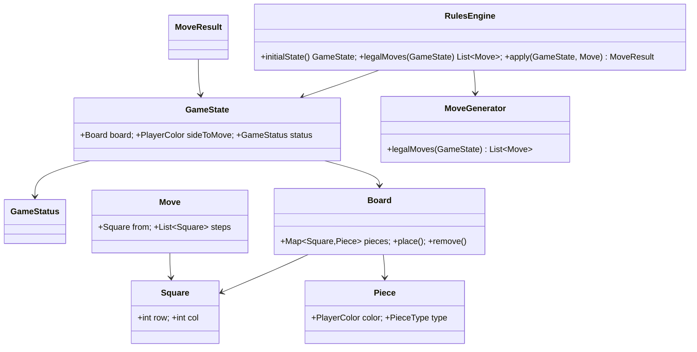

# Feature0002 — Checkers Rules Engine (Deutsche Dame) — Design

**Date:** 2026-06-24
**Feature:** [backlog/Feature0002/Feature0002.md](../../../backlog/Feature0002/Feature0002.md)
**Module:** `:business`
**Status:** Approved (brainstorming) — ready for implementation plan

## Goal

A self-contained, fully tested domain model and rules engine for **Deutsche Dame**
(German checkers) that is the single source of truth for what is legal. No networking,
no persistence, no UI. The engine is framework-agnostic plain Java (no Quarkus
dependency), deterministic, and side-effect free: the same input always produces the
same output.

This engine realizes the project's anti-cheat principle: the client never decides what
is legal; it only submits move *intentions* that this engine validates.

## Confirmed design decisions

| Topic | Decision |
|---|---|
| Coordinate system | `Square(row, col)`, both 0–7. Row 0 = top, row 7 = bottom. Playable (dark) squares are those where `(row + col)` is odd. |
| Move representation | `Move(from, steps)` — origin square plus the ordered list of landing squares. A simple move has one step; a multi-jump has several. The engine derives which pieces are captured. |
| Illegal-move signalling | `apply` returns a `MoveResult` — `Applied(newState)` or `Rejected(reason)`. No exceptions for expected control flow. |
| Game-end detection | `GameStatus` is `InProgress` or `Win(winner)`. A win is detected when the side to move has no legal move. Draw-by-agreement is **not** decided by the engine (left to session/UI in 0003/0006). No automatic draws (no repetition / no-progress counters). |
| Colors & first move | `PlayerColor` = `WHITE`, `BLACK`. **WHITE moves first.** BLACK occupies the top rows (0–2); WHITE the bottom rows (5–7). WHITE men move toward row 0; BLACK men move toward row 7. |
| Engine internals | Approach A: immutable records/enums + a `MoveGenerator` + a `RulesEngine` façade. A move is legal iff it is a member of `legalMoves(state)`, so validation and generation cannot drift. No polymorphic piece strategies, no bitboards. |

## Global Constraints

- Java **17**, base package **`ai.dame.business`** (new sub-package `game`).
- All code, docs, properties in **English**.
- Pure logic only — **no** dependency on `:rest`, `:app`, Quarkus, or any I/O.
- Deterministic and side-effect free: same input → same output; inputs never mutated.
- TDD: every behavior is covered by a unit test asserting on real output. No bare
  `contextLoads()`-style test.
- **No maximal-capture (Mehrheitsschlag)** rule. Men capture **forward only**.
- Git commits are performed by the developer, never by the executing agent.

## Architecture

All types live under `ai.dame.business.game`, a sibling of the existing `health` package.

```
ai.dame.business.game
├── Square          (record)  a playable position (row, col); constructor rejects invalid squares
├── PlayerColor     (enum)    WHITE, BLACK; opponent()
├── PieceType       (enum)    MAN, DAME
├── Piece           (record)  color + type
├── Board           (record)  immutable Map<Square, Piece>; place/remove return new boards
├── Move            (record)  from + ordered List<Square> steps
├── GameStatus      (sealed)  InProgress | Win(PlayerColor winner)
├── GameState       (record)  board + sideToMove + status
├── MoveResult      (sealed)  Applied(GameState newState) | Rejected(RejectionReason reason)
├── RejectionReason (enum)    GAME_OVER, NO_PIECE_AT_FROM, NOT_YOUR_PIECE,
│                             CAPTURE_REQUIRED, INCOMPLETE_CAPTURE, ILLEGAL_PATH
├── MoveGenerator   (class)   legalMoves(GameState) -> List<Move>
└── RulesEngine     (class)   public façade: initialState(), legalMoves(state), apply(state, move)
```



### Public API (the contract Feature0004 will serialize)

- `GameState initialState()` — the 12-vs-12 starting position, WHITE to move, `InProgress`.
- `List<Move> legalMoves(GameState state)` — exactly the legal moves for `sideToMove`,
  with Schlagzwang already applied (only captures when any capture exists).
- `MoveResult apply(GameState state, Move move)` — `Applied(newState)` on success, else
  `Rejected(reason)`.

### Coordinate system & board orientation

- `Square(int row, int col)` with `0 ≤ row,col ≤ 7`. The constructor throws
  `IllegalArgumentException` for out-of-range coordinates or light squares
  (`(row+col)` even), so an invalid square cannot be constructed.
- Row 0 is the top of the board, row 7 the bottom.
- **BLACK** men start on the dark squares of rows **0–2** and move toward **row 7**
  (promotion row 7). **WHITE** men start on rows **5–7** and move toward **row 0**
  (promotion row 0). WHITE moves first.

### Immutability

Every type is a `record` or `enum`. `Board` holds an unmodifiable `Map<Square, Piece>`
containing only occupied squares; `place`/`remove` return new `Board` instances. `apply`
never mutates its input `GameState`; it returns a fresh one. This guarantees the
determinism/side-effect-free requirement.

## Move generation & rules

`MoveGenerator.legalMoves(state)` produces the exact legal set for the side to move:

1. **Schlagzwang ordering.** Generate all capture moves first. If any capture exists,
   return **only** captures (simple moves dropped). Otherwise return the simple moves.

2. **Man — simple move.** One square diagonally **forward** (toward row 0 for WHITE,
   toward row 7 for BLACK) onto an empty playable square. Two candidate directions.

3. **Man — capture.** Jump a single **adjacent enemy** piece, landing on the empty
   square **immediately beyond**, **forward only**. Men may **not** capture backward.

4. **Dame (flying king) — simple move.** Slides any number of empty squares along any of
   the 4 diagonals (forward or backward), stopping before the first occupied square.

5. **Dame — capture.** Slides along a diagonal over any number of empty squares, jumps
   **exactly one** enemy piece, and lands on **any** empty square beyond it (each landing
   choice is a distinct move/continuation). Cannot jump two pieces in a row; cannot jump
   a piece of its own color.

6. **Multi-capture (chained jumps).** A started capture must continue while another
   capture is available from the landing square. Generation is a recursive search:
   - From the current square, enumerate every immediate capture.
   - For each, mark the captured square as jumped, advance to the landing square, recurse.
   - A capture sequence is a **complete legal move** only when no further capture is
     possible from its final landing square. Partial chains are **not** legal moves.
   - Captured pieces are removed only at the **end** of the turn, but a square already
     jumped in the chain cannot be jumped again (tracked in a jumped-square set during the
     search).

7. **Promotion timing.** A man reaching its back row is promoted to Dame **at the end of
   the move only**. If a man lands on the back row *mid-chain* (the capture continues
   onward), it is **not** promoted and keeps moving as a man for the rest of that chain.
   The generator promotes only after the chain terminates.

### `apply(state, move)` algorithm

1. If `state.status` is not `InProgress` → `Rejected(GAME_OVER)`.
2. Compute `legalMoves(state)`. If `move` is in the set: build the next `Board` (move the
   piece, remove all captured pieces, promote if the final square is the back row), flip
   `sideToMove`, recompute status, return `Applied(newState)`.
3. Otherwise → `Rejected(reason)`, where the reason is refined by inspecting the move:
   - `NO_PIECE_AT_FROM` — `from` is empty.
   - `NOT_YOUR_PIECE` — piece at `from` is not the side to move's.
   - `CAPTURE_REQUIRED` — a simple move was submitted while captures exist.
   - `INCOMPLETE_CAPTURE` — the move is a valid prefix of a longer mandatory chain.
   - `ILLEGAL_PATH` — anything else not matching a legal move.

### Status after a move

Recompute `legalMoves` for the new side to move. If empty → `Win(colorThatJustMoved)`;
otherwise `InProgress`. (A side with no pieces, or all pieces blocked, has no legal move.)

## Testing strategy

The engine is pure logic, so **unit tests only** (no integration/e2e for this feature).
Tests in `business/src/test/java/ai/dame/business/game/`, asserting on real output.

- **`SquareTest`** — accepts the 32 dark squares; rejects off-board (`-1`, `8`) and light
  squares (`(row+col)` even).
- **`BoardTest`** — `initialBoard`: 12 WHITE on rows 5–7, 12 BLACK on rows 0–2, all on
  dark squares; `place`/`remove` return new instances and don't mutate the original.
- **`MoveGeneratorTest`** (`@Nested` groups):
  - *Simple men moves:* forward diagonals only; blocked by occupancy and edges; correct
    count from the opening position.
  - *Men captures:* forward capture available; **men cannot capture backward**; capture is
    forced when available (Schlagzwang — no simple moves returned).
  - *Multi-capture:* a two-jump chain is one move; a single-jump prefix of it is **not** in
    the legal set; correct branching with two continuations.
  - *Promotion:* man landing on the final back-row square becomes a Dame; man passing
    *through* the back row mid-chain is **not** promoted and continues as a man.
  - *Dame movement:* slides multiple empty squares in all four directions; blocked by the
    first occupied square.
  - *Dame capture:* distance capture with a choice of landing squares (each a distinct
    move); cannot jump two pieces; cannot jump own color.
- **`RulesEngineTest`** — `initialState` (WHITE to move, `InProgress`); `apply` of a legal
  move returns `Applied` with `sideToMove` flipped and the input state unchanged; `apply`
  of each illegal category returns `Rejected` with the correct `RejectionReason`; **win
  detection** from a hand-built end position; `apply` on a finished game → `Rejected(GAME_OVER)`.

## Documentation deliverables (Definition of Done)

- **`docs/glossar.md`** — fill the stub: Stein/Man, Dame/King (flying king), Schlagzwang
  (forced capture), Zug/Move, Schlag/Capture, Mehrfachschlag/multi-capture,
  Umwandlung/promotion, plus WHITE/BLACK board orientation.
- **`docs/tech/20_DomainModel.md`** — replace the stub with the real model: the Mermaid
  class diagram above, a description of each type, the coordinate system, and board
  orientation.
- **`docs/tech/40_Api.md`** — document the engine's public contract (`RulesEngine`
  methods, the `Move` JSON shape `{from:{row,col}, steps:[{row,col}…]}`, `MoveResult`,
  `RejectionReason`) since this is the contract Feature0004 will serialize.
- **`docs/handbook/handbook.md`** — player-facing rules of Deutsche Dame in plain language
  (no code/types): the board, moving men forward, capturing, forced capture
  (Schlagzwang), multi-captures, promotion to Dame, the flying king, and how to win/draw.
  Drawn from the same authoritative rules the engine implements, so they stay consistent.
- **ADR 0009** in `docs/tech/99_ArchitecturalDecisions.md` — record the engine decisions:
  row/col coordinates, move representation, `MoveResult` over exceptions,
  validation-by-generation, no-mid-chain-promotion, win-only end detection.

## Out of scope (deferred)

- Turn ownership across two network players, sessions, time → Feature0003/0004.
- Persistence, WebSocket, REST → Feature0003/0004.
- Draw-by-agreement decision logic → session/UI layer.
- Mehrheitsschlag (maximal capture) and automatic draws (repetition / no-progress) — not
  part of this rule variant.
