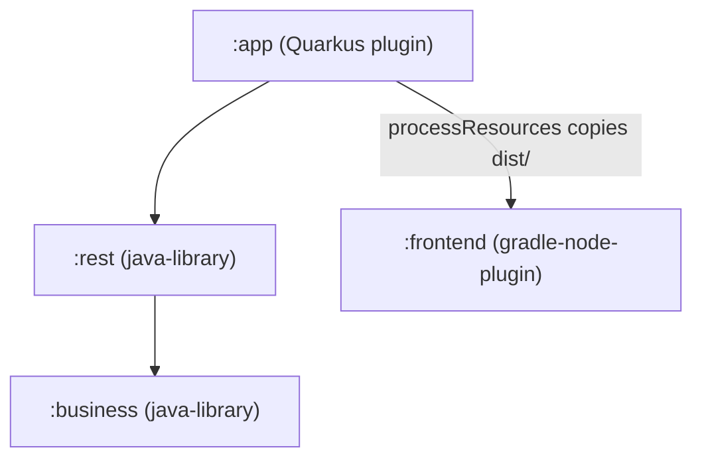

# ADR 0001 — Build System and Module Structure

**Date:** 2026-06-22
**Status:** Accepted
**Feature:** Feature0001 — Project Scaffolding & Build Foundation

---

## Context

dame-ai is a browser-based two-player checkers (Draughts) game with a Quarkus backend and a React SPA. The initial scaffold must:

- Separate concerns cleanly across backend layers.
- Allow Quarkus to discover CDI beans and JAX-RS resources defined in library modules.
- Serve the React production build as static content without an additional proxy or a Quinoa integration.
- Support a smooth developer workflow with hot-reload for both frontend and backend.
- Provide a single `./gradlew build` command that compiles, tests and packages everything.

---

## Module Graph



Dependency direction is strictly `:app → :rest → :business`. `:frontend` is a sibling subproject — it does **not** appear on any backend module's classpath. The only coupling between backend and frontend is the Gradle `processResources` task in `:app`, which copies `frontend/dist/` into the Quarkus static-resources path.

### Subproject responsibilities

| Module | Gradle plugin | Role |
|--------|--------------|------|
| `:business` | `java-library` + kordamp Jandex | Domain services (pure CDI beans, no HTTP) |
| `:rest` | `java-library` + kordamp Jandex | JAX-RS resources; depends on `:business` |
| `:app` | `io.quarkus` | Assembly module; wires everything; runs the app |
| `:frontend` | `com.github.node-gradle.node` | React SPA; Gradle drives npm build & tests |

---

## Decisions

### Gradle 9.5.1 + Quarkus 3.36.3

Quarkus 3.36 targets Gradle 9.x. Gradle 8.x is **incompatible** with this Quarkus line and causes hard build failures (plugin API incompatibilities). The Gradle wrapper is pinned to **9.5.1**. The Quarkus platform BOM and Gradle plugin are pinned to **3.36.3** (latest patch of the 3.36 stream as of mid-2026).

### Kordamp Jandex Plugin for Library Modules

Quarkus performs bean discovery via the Jandex index. Library modules (`:business`, `:rest`) that are not built with the Quarkus plugin do not produce a Jandex index by default. Without an index, Quarkus cannot discover `@ApplicationScoped` beans or `@Path` resources defined there.

The **kordamp `org.kordamp.gradle.jandex` plugin (version 2.1.0)** is applied to both `:business` and `:rest`. It generates a `META-INF/jandex.idx` file in each library's JAR, which Quarkus reads at startup for CDI and JAX-RS scanning.

Fallback (if `@Inject` fails at runtime): add the following to `app/src/main/resources/application.properties`:
```properties
quarkus.index-dependency.rest.group-id=ai.dame
quarkus.index-dependency.rest.artifact-id=rest
quarkus.index-dependency.business.group-id=ai.dame
quarkus.index-dependency.business.artifact-id=business
```

### `/api` REST Prefix Convention

All JAX-RS resources use the `/api` path prefix (e.g. `@Path("/api/health")`). This prevents any REST path from colliding with frontend routes served from `/`. The React app fetches `/api/*` endpoints; the Vite dev server proxies them to `http://localhost:8080`.

### `@QuarkusMain` Entry Point

`:app` contains an explicit `@QuarkusMain` class `ai.dame.app.Application` that delegates to `Quarkus.run(args)`. While Quarkus can auto-generate a main entry point for standard JAR packaging, an explicit Java source file is required for `./gradlew :app:quarkusDev` to treat `:app` as a Java project in this Gradle multi-module setup. The entry point is therefore provided explicitly rather than relying on augmentation.

### Frontend Served as Static Resources (No Quinoa)

The React SPA is a standard Vite build. Its `dist/` output is copied into `src/main/resources/META-INF/resources` inside the Quarkus packaged artifact via a Gradle `processResources` hook in `:app`. Quarkus serves files under `META-INF/resources` at the root path `/` with no extra configuration.

This approach was chosen over Quinoa to keep the toolchain simple and to avoid Quinoa's additional constraints around Vite configuration. The trade-off is that `./gradlew :app:quarkusDev` always rebuilds the frontend bundle before starting; live hot-reload during frontend development requires the Vite dev server (see Developer Workflow below).

### Integration Tests via `@QuarkusIntegrationTest`

The project directive requires integration tests in a separate folder (`src/integrationTest/java`). The Quarkus Gradle plugin provides the `quarkusIntTest` task, which:

1. Builds the full application artifact via `quarkusBuild`.
2. Launches it as a black-box process.
3. Runs all `@QuarkusIntegrationTest`-annotated tests against it over HTTP.

This maps exactly onto the project's "integration-test" concept. A hand-rolled `Test` task pointing at the `integrationTest` source set would **not** boot the Quarkus runtime and must not be used. The `quarkusIntTest` task is wired into `:app:check` so it runs automatically during `./gradlew build`.

### Cypress E2E (Separate from Gradle Build)

Cypress e2e tests live in `frontend/cypress/e2e/` and are run with `npm run e2e` (or `npx cypress run`). They are **not** part of `./gradlew build` because they require a running application server. The standard workflow is:

1. Start: `./gradlew :app:quarkusDev` (or `./gradlew :app:quarkusBuild && java -jar app/build/quarkus-app/quarkus-run.jar`)
2. Run e2e: `cd frontend && npm run e2e`

---

## Developer Workflow

### Option A — Full-stack dev with live frontend hot-reload

```
Terminal 1: ./gradlew :app:quarkusDev          # starts Quarkus on :8080; API hot-reloads
Terminal 2: cd frontend && npm install && npm run dev  # Vite dev server on :5173
```

Vite proxies `/api/*` requests to `http://localhost:8080` (configured in `vite.config.ts`). Open `http://localhost:5173` in the browser.

### Option B — Full-stack preview (bundled build served by Quarkus)

```
./gradlew :app:quarkusDev   # builds frontend dist, serves at http://localhost:8080
```

---

## Test Folder Convention

| Test type | Location | Runner |
|-----------|----------|--------|
| Backend unit | `<module>/src/test/java/` | `./gradlew test` |
| Backend integration | `app/src/integrationTest/java/` (`@QuarkusIntegrationTest`) | `./gradlew :app:quarkusIntTest` |
| Frontend unit | `frontend/src/*.test.tsx` (Vitest) | `./gradlew :frontend:testFrontend` or `cd frontend && npm test` |
| E2E | `frontend/cypress/e2e/` (Cypress) | `cd frontend && npm run e2e` (needs server running) |

---

## Consequences

- Adding a new backend library module requires applying the kordamp Jandex plugin to that module.
- New JAX-RS paths must use the `/api` prefix.
- Frontend changes are automatically included in `./gradlew build` via the `assembleFrontend` task dependency chain.
- Cypress e2e must be run separately from the main Gradle build.
