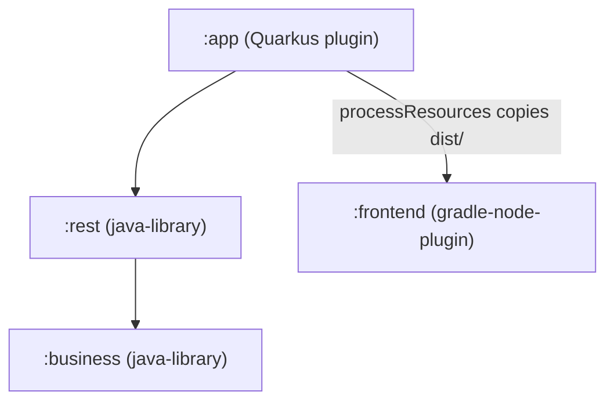

# Architecture

## Module graph

Dependency direction is strictly `:app → :rest → :business`. `:frontend` is a sibling subproject —
it does **not** appear on any backend module's classpath. The only backend↔frontend coupling is the
Gradle `processResources` task in `:app`, which copies `frontend/dist/` into the Quarkus
static-resources path.

## Subproject responsibilities

| Module | Gradle plugin | Role |
|--------|---------------|------|
| `:business` | `java-library` + kordamp Jandex | Domain services (pure CDI beans, no HTTP) |
| `:rest` | `java-library` + kordamp Jandex | JAX-RS resources; depends on `:business` |
| `:app` | `io.quarkus` | Assembly module; wires everything; runs the app |
| `:frontend` | `com.github.node-gradle.node` | React SPA; Gradle drives the npm build & tests |

## Frontend served as static resources

The React SPA is a standard Vite build. Its `dist/` output is copied into `META-INF/resources` of
the Quarkus artifact via the `processResources` hook in `:app`; Quarkus serves files under
`META-INF/resources` at `/` with no extra configuration. (Rationale and alternatives considered:
ADR 0003 in [99_ArchitecturalDecisions.md](99_ArchitecturalDecisions.md).)

## `/api` separation

All JAX-RS resources use the `/api` path prefix so REST endpoints never collide with SPA routes
served from `/`. See [40_Api.md](40_Api.md).

For the rationale behind these structural choices, see
[99_ArchitecturalDecisions.md](99_ArchitecturalDecisions.md).
